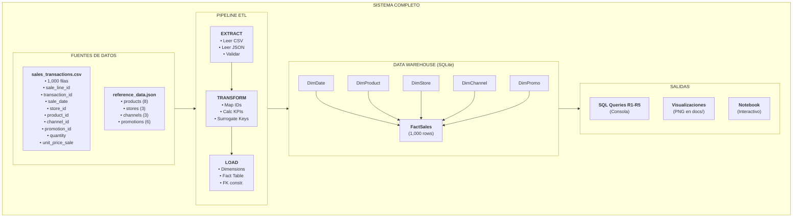
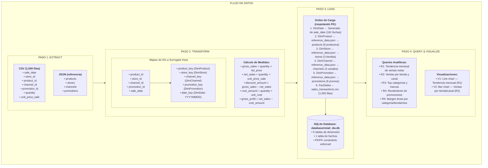
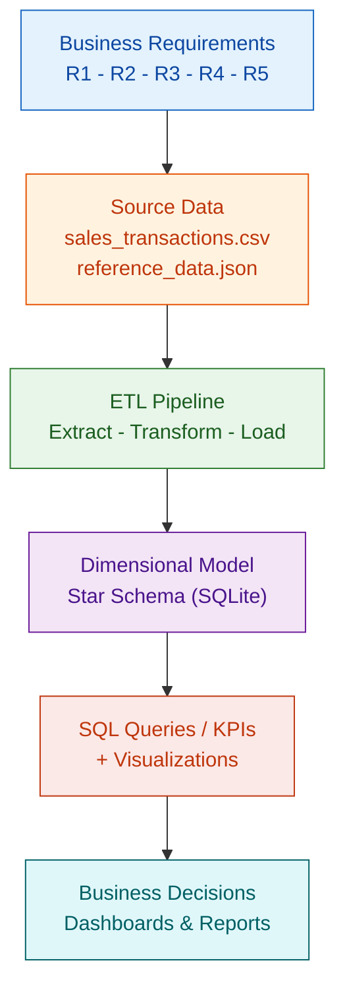
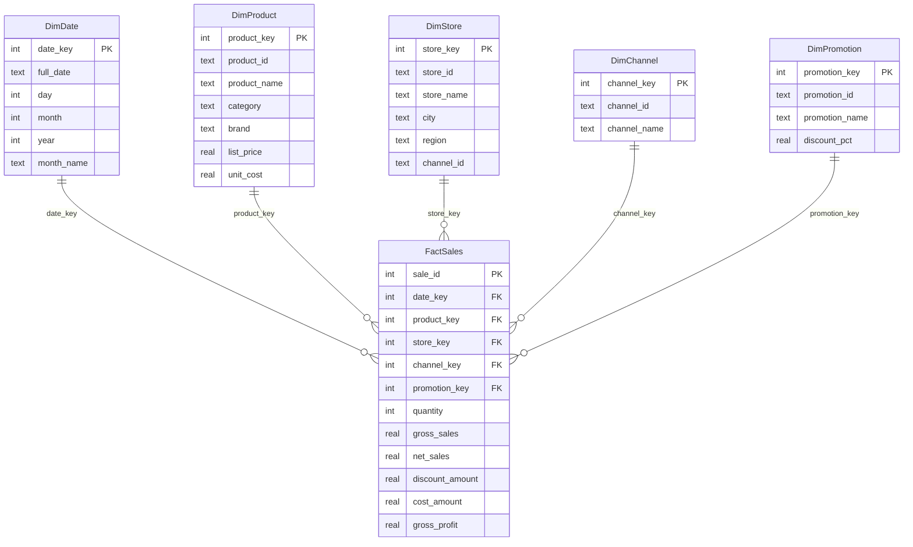

# Lab 2 — Dimensional Data Warehouse: Retail Technology Sales

> **ETL (G01) — Universidad Autonoma de Occidente**
> Unit 1, Activity 3

---

## Authors

- **Deyton Riascos Ortiz** — [GitHub](https://github.com/driosoft-pro)
- **Samuel Izquierdo Bonilla** — [GitHub](https://github.com/ZantaCruz)
- **Daniel David Garcia Restrepo** — [GitHub](https://github.com/danielrestrepo13)
- **Mauricio Taborda Gongora** — [GitHub](https://github.com/Taborda004)

---

## 1. Project Objective

Design and implement a **dimensional Data Warehouse** for a retail technology company that operates two physical stores and one national online store. The goal is to consolidate six months of sales data (January–June 2026) into a Star Schema model that supports recurring analytical queries and future dashboards.

---

## 2. Business Scenario

A retail technology company needs to consolidate sales information across all channels into a Data Warehouse. The analytical solution must be designed around five business requirements that drive every modeling decision — dimensions, facts, measures, KPIs, queries, and visualizations.

**Dataset coverage:** 1,000 sales lines, January–June 2026, two physical stores, one online store, four product categories, four brands, and multiple promotion conditions.

---

## 3. Business Requirements

| ID | Business Requirement |
|----|----------------------|
| **R1** | Monitor monthly net sales trends and identify periods of growth or decline. |
| **R2** | Compare sales performance across stores and sales channels over time. |
| **R3** | Identify the top-performing product categories and brands using revenue and units sold. |
| **R4** | Evaluate promotion performance by comparing sales, units, and discounts across promotion types. |
| **R5** | Analyze gross profit and gross margin by product category, store, and month. |

---

## 4. System Architecture

### 4.1 General Architecture Diagram



### 4.2 Data Flow Detail



### 4.3 Conceptual Flow (Systems Thinking)



---

## 5. Dimensional Model Design

### 5.1 Four-Step Dimensional Design

| Step | Decision |
|------|----------|
| **1. Business Process** | Retail sales transactions (each sale line). |
| **2. Grain** | One row in the fact table represents **one sales line item** (one product, one transaction, one day, one store/channel). |
| **3. Dimensions** | `DimDate`, `DimProduct`, `DimStore`, `DimChannel`, `DimPromotion` |
| **4. Facts/Measures** | `quantity`, `gross_sales`, `net_sales`, `discount_amount`, `cost_amount`, `gross_profit` |

### 5.2 Star Schema Diagram



## 6. Dimensions, Facts, and Measures

### Dimensions

| Dimension | Key | Description | Driven by |
|-----------|-----|-------------|-----------|
| `DimDate` | `date_key` (INTEGER) | Calendar date dimension derived from `sale_date`. | R1, R2, R5 |
| `DimProduct` | `product_key` (INTEGER) | Product catalog with category, brand, price, cost. | R3, R5 |
| `DimStore` | `store_key` (INTEGER) | Store/channel location with city and region. | R2, R5 |
| `DimChannel` | `channel_key` (INTEGER) | Sales channel (physical or online). | R2 |
| `DimPromotion` | `promotion_key` (INTEGER) | Promotion type and discount percentage. | R4 |

### Fact Table — `FactSales`

| Column | Type | Description |
|--------|------|-------------|
| `date_key` | INTEGER (FK) | References `DimDate` |
| `product_key` | INTEGER (FK) | References `DimProduct` |
| `store_key` | INTEGER (FK) | References `DimStore` |
| `channel_key` | INTEGER (FK) | References `DimChannel` |
| `promotion_key` | INTEGER (FK) | References `DimPromotion` |
| `quantity` | INTEGER | Units sold |
| `gross_sales` | REAL | `quantity × list_price` |
| `net_sales` | REAL | `quantity × unit_price_sale` |
| `discount_amount` | REAL | `gross_sales − net_sales` |
| `cost_amount` | REAL | `quantity × unit_cost` |
| `gross_profit` | REAL | `net_sales − cost_amount` |

---

## 7. How to Run the Project

### 7.1 Prerequisites

- Python 3.10+
- SQLite3 (included in Python standard library)
- NixOS (optional, for `nix develop`)

### 7.2 Option 1: Using Nix (Recommended for NixOS)

```bash
# Enter the development environment
nix develop

# Run the full pipeline
python src/main.py

# Or use the run script
./scripts/run.sh              # Full pipeline
./scripts/run.sh --schema     # Create schema only
./scripts/run.sh --load       # Load data only
./scripts/run.sh --queries    # Run queries only
./scripts/run.sh --viz        # Generate visualizations only
```

### 7.3 Option 2: Using pip

```bash
# Install dependencies
pip install -r requirements.txt

# Run the full pipeline
python src/main.py
```

### 7.4 Option 3: Using uv (Virtual Environment)

```bash
# Create virtual environment
uv venv --system-site-packages
source .venv/bin/activate

# Install dependencies
uv pip install -r requirements.txt

# Run the full pipeline
python src/main.py
```

### 7.5 Running Individual Modules

```bash
python src/create_schema.py    # Create tables only
python src/load_dimensions.py  # Load dimensions only
python src/load_fact.py        # Load FactSales only
python src/queries.py          # Run the five queries only
python src/visualization.py    # Generate charts only
```

### 7.6 Using Jupyter Notebook

```bash
# Install Jupyter (if not already installed)
pip install jupyter

# Launch JupyterLab
jupyter lab

# Open the notebook
# notebooks/01_dimensional_modeling.ipynb
```

### 7.7 Windows Users

```batch
# Using pip
pip install -r requirements.txt
python src\main.py

# Or using the batch scripts
scripts\run.bat              :: Full pipeline
scripts\run.bat --schema     :: Create schema only
scripts\run.bat --load       :: Load data only
scripts\run.bat --queries    :: Run queries only
scripts\run.bat --viz        :: Generate visualizations only

# Setup virtual environment
scripts\setup.bat

# Clean generated files
scripts\clean.bat
```

### 7.8 Output

- **Database file:** `database/retail_dw.db`
- **Console output:** 5 SQL queries (R1–R5) + 2 visualizations saved to `docs/`
- **Visualizations:**
  - `docs/visualization_monthly_sales.png` — Monthly net sales trend
  - `docs/visualization_sales_by_store.png` — Sales by store and channel

---

## 8. Load Order and Surrogate Key Strategy

### Load Order

1. **DimDate** — Generated from `sale_date` values (January–June 2026).
2. **DimProduct** — Loaded from `reference_data.json → products`.
3. **DimStore** — Loaded from `reference_data.json → stores`.
4. **DimChannel** — Loaded from `reference_data.json → channels`.
5. **DimPromotion** — Loaded from `reference_data.json → promotions`.
6. **FactSales** — Loaded last, mapping source identifiers to surrogate keys and computing measures.

### Surrogate Key Strategy

- All surrogate keys are **auto-increment integers** starting from 1.
- Source natural keys (`sale_line_id`, `transaction_id`, `product_id`, etc.) are used only for mapping during the load process — they are **not** stored in the dimensional model.
- This ensures independence from source system changes and supports future SCD implementations.

---

## 9. SQL Queries / KPIs Mapped to Business Requirements

### R1 — Monthly Net Sales Trend

```sql
SELECT d.year, d.month, d.month_name,
       SUM(f.net_sales) AS total_net_sales
FROM FactSales f
JOIN DimDate d ON f.date_key = d.date_key
GROUP BY d.year, d.month, d.month_name
ORDER BY d.year, d.month;
```

### R2 — Sales by Store and Channel

```sql
SELECT s.store_name, c.channel_name,
       SUM(f.net_sales) AS total_net_sales
FROM FactSales f
JOIN DimStore s ON f.store_key = s.store_key
JOIN DimChannel c ON f.channel_key = c.channel_key
GROUP BY s.store_name, c.channel_name
ORDER BY total_net_sales DESC;
```

### R3 — Top Categories and Brands

```sql
SELECT p.category, p.brand,
       SUM(f.net_sales) AS total_revenue,
       SUM(f.quantity) AS total_units
FROM FactSales f
JOIN DimProduct p ON f.product_key = p.product_key
GROUP BY p.category, p.brand
ORDER BY total_revenue DESC;
```

### R4 — Promotion Performance

```sql
SELECT pr.promotion_name, pr.discount_pct,
       SUM(f.net_sales) AS total_sales,
       SUM(f.quantity) AS total_units,
       SUM(f.discount_amount) AS total_discount
FROM FactSales f
JOIN DimPromotion pr ON f.promotion_key = pr.promotion_key
GROUP BY pr.promotion_name, pr.discount_pct
ORDER BY total_sales DESC;
```

### R5 — Gross Profit and Margin by Category/Store/Month

```sql
SELECT p.category, s.store_name, d.month_name,
       SUM(f.gross_profit) AS total_gross_profit,
       SUM(f.gross_profit) / SUM(f.net_sales) * 100 AS gross_margin_pct
FROM FactSales f
JOIN DimProduct p ON f.product_key = p.product_key
JOIN DimStore s ON f.store_key = s.store_key
JOIN DimDate d ON f.date_key = d.date_key
GROUP BY p.category, s.store_name, d.month_name
ORDER BY gross_margin_pct DESC;
```

---

## 10. Analytical Visualizations

### Visualization 1 — Monthly Net Sales Trend (Temporal)
- **Chart type:** Line chart
- **Purpose:** Identify growth/decline periods over Jan–Jun 2026 (R1)

### Visualization 2 — Sales by Store and Channel (Comparative)
- **Chart type:** Bar chart (grouped)
- **Purpose:** Compare sales performance across stores and channels (R2)

---

## 11. Final Reflection

### How did the business requirements influence your dimensional model?
The five business requirements (R1–R5) were the foundation of every modeling decision. We only created dimensions and facts that directly answer these requirements. For example, `DimPromotion` exists solely because R4 requires analyzing promotion performance, and `gross_margin` is calculated at query time rather than stored in the fact table to avoid aggregation issues.

### What would be the impact of choosing an incorrect grain?
An incorrect grain would lead to either data loss (too coarse) or redundant/inconsistent data (too fine). For example, if we chose transaction-level grain instead of line-item grain, we could not analyze individual product performance. Conversely, a daily aggregated grain would lose the ability to compare individual products or promotions.

### Did your final model contain any table or attribute that was not necessary?
No. Every dimension and measure in the model is justified by at least one business requirement. We deliberately avoided copying all source fields into the Data Warehouse, keeping the model lean and purpose-driven.

---

## 12. Repository Layout

```
lab2-dimensional-dw/
├── flake.nix                    # NixOS environment (Python 3.12 + uv + Jupyter)
├── requirements.txt             # Python dependencies
├── guion.md                     # Presentation guide
├── README.md                    # This file
│
├── scripts/                     # Execution scripts
│   ├── run.sh                   # Run pipeline (Linux/macOS)
│   ├── run.bat                  # Run pipeline (Windows)
│   ├── setup.sh                 # Setup environment (Linux/macOS)
│   ├── setup.bat                # Setup environment (Windows)
│   ├── clean.sh                 # Clean generated files (Linux/macOS)
│   └── clean.bat                # Clean generated files (Windows)
│
├── data/                        # Source data
│   ├── sales_transactions.csv   # 1,000 sale lines
│   ├── reference_data.json      # Products, stores, channels, promotions
│   └── DATA_DICTIONARY.md       # Data dictionary
│
├── src/                         # ETL source code
│   ├── main.py                  # Main orchestrator
│   ├── create_schema.py         # Star Schema DDL
│   ├── load_dimensions.py       # Load 5 dimensions
│   ├── load_fact.py             # Load FactSales
│   ├── queries.py               # Queries R1-R5
│   └── visualization.py         # Generate charts
│
├── database/                    # Generated Data Warehouse
│   └── retail_dw.db             # SQLite database
│
├── notebooks/                   # Interactive notebooks
│   └── 01_dimensional_modeling.ipynb
│
└── docs/                        # Documentation and outputs
    ├── plan.md                  # Project plan
    ├── visualization_monthly_sales.png
    └── visualization_sales_by_store.png
```

---

## License

Academic use only — Universidad Autonoma de Occidente, ETL Course (G01), 2026-2.
