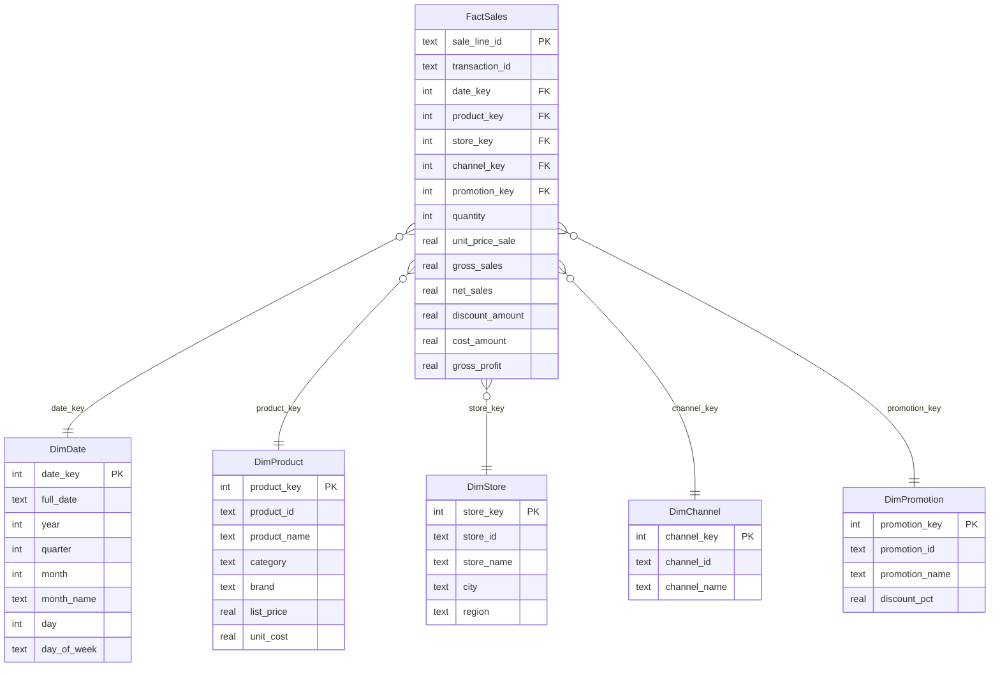

# Retail Sales Data Warehouse — Lab 2

**Course:** ETL — Group 1, 2026-2  


---

## What this project does

This project takes raw sales data from a tech retail company and organizes it into a small dimensional database so the business can answer five specific questions about its sales performance.

The company sells products across two physical stores (Cali Centro and Bogota Norte) and one online store (Online Colombia). The dataset has 1,000 recorded sale lines, 20 products in four categories, four brands, and four promotion types. The goal is to load this data into a star schema and write SQL queries that prove the model actually works.

---

## The five business requirements

| ID | What the business wants to know |
|---|---|
| R1 | Is revenue growing month over month during the first half of 2026? |
| R2 | Which store and which channel (physical vs. online) sells the most? |
| R3 | Which product categories and brands move the most units and revenue? |
| R4 | How much discount did each promotion type give away, and was it worth it? |
| R5 | Where is the company actually making money? What is the gross margin by category, store, and month? |

---

## Pipeline overview

The data moves through four steps before it can answer any of the questions above:

```
sales_transactions.csv          reference_data.json
        |                               |
        +------------- ETL -------------+
                         |
              Python scripts (src/)
                         |
              retail_dw.db (SQLite)
              ┌──────────────────┐
              │  DimDate         │
              │  DimProduct      │
              │  DimStore        │
              │  DimChannel      │
              │  DimPromotion    │
              │  FactSales       │
              └──────────────────┘
                         |
              SQL queries (R1 – R5)
                         |
              Two charts saved in docs/
```

---

## Business process and fact table grain

**Business process:** Sale of tech products at retail locations and online.

**Grain of FactSales:**  
One row = one sale line (`sale_line_id`). A single transaction can contain multiple sale lines if the customer bought more than one product. This grain is fine enough to slice by product, store, channel, promotion, and day all at once.

---

## Star schema diagram


> Gold badge = primary key · Indigo = foreign key · Green = additive measure  
> Dashed arrows = foreign-key relationships from each dimension to FactSales.

<details>
<summary>Mermaid source (text version)</summary>



</details>

---

## Why each table is in the model

Every table exists because at least one business requirement needs it. Nothing was added just to make the schema look bigger.

| Table | Required by | Why |
|---|---|---|
| DimDate | R1, R5 | Monthly grouping for trend analysis and margin breakdown |
| DimProduct | R3, R5 | Category and brand breakdown; also holds list_price and unit_cost |
| DimStore | R2, R5 | Compare Cali Centro, Bogota Norte, and Online Colombia |
| DimChannel | R2 | Separate physical from online without relying on store name |
| DimPromotion | R4 | Measure how much each discount type cost the company |

---

## Dimensions and measures

### Dimensions

| Table | Rows | Surrogate key | Source |
|---|---|---|---|
| DimDate | 180 | YYYYMMDD integer | Derived from sale_date in the CSV |
| DimProduct | 20 | AUTOINCREMENT | reference_data.json → products |
| DimStore | 3 | AUTOINCREMENT | reference_data.json → stores |
| DimChannel | 2 | AUTOINCREMENT | reference_data.json → channels |
| DimPromotion | 4 | AUTOINCREMENT | reference_data.json → promotions |

### Measures in FactSales (all in COP)

| Column | Formula | Used in |
|---|---|---|
| `quantity` | from CSV directly | R3, R4 |
| `gross_sales` | `quantity × list_price` | R4, R5 |
| `net_sales` | `quantity × unit_price_sale` | R1, R2, R3, R4, R5 |
| `discount_amount` | `gross_sales − net_sales` | R4 |
| `cost_amount` | `quantity × unit_cost` | R5 |
| `gross_profit` | `net_sales − cost_amount` | R5 |

`gross_margin_%` is **not stored** in FactSales. A percentage cannot be meaningfully summed across rows (adding 30% + 20% does not give 50%). It is computed at query time as `SUM(gross_profit) / SUM(net_sales) * 100`.

---

## Load order and surrogate key strategy

Dimensions must be loaded before the fact table because FactSales references their surrogate keys:

```
1. DimDate        → key format: YYYYMMDD integer (naturally sortable)
2. DimChannel     → key: AUTOINCREMENT
3. DimStore       → key: AUTOINCREMENT
4. DimProduct     → key: AUTOINCREMENT
5. DimPromotion   → key: AUTOINCREMENT
─────────────────────────────────────────
6. FactSales      → looks up surrogate keys from all five dimensions
                    before inserting each row
```

The original source IDs (`S01`, `P001`, `PR10`, etc.) are kept in each dimension table for reference, but the fact table only stores the integer surrogate keys.

---

## How to run it

**Requirements:** Python 3.8+ and pip.

Install dependencies:
```bash
pip install -r requirements.txt
```

Launch the console menu:
```bash
python src/main.py
```

The menu looks like this:

```
  ╔══════════════════════════════════════════════════╗
  ║   Retail Sales DW — Lab 2  (ETL-G1 2026-2)      ║
  ║   Database: not found                            ║
  ╠══════════════════════════════════════════════════╣
  ║  1. Run full pipeline  (schema + load + queries) ║
  ║  2. Create schema only                           ║
  ║  3. Load dimensions only                         ║
  ║  4. Load FactSales only                          ║
  ║  5. Run SQL queries                              ║
  ║  6. Generate charts                              ║
  ║  7. Show row counts                              ║
  ║  0. Exit                                         ║
  ╚══════════════════════════════════════════════════╝
  Select an option:
```

**First time:** choose **option 1** to run the complete pipeline from scratch.  
Option 5 opens a sub-menu where you can run each requirement query individually (R1 through R5) or all five at once.  
The status line at the top shows whether the database already exists.

You can also run each module directly without the menu:
```bash
python src/create_schema.py    # create tables only
python src/load_dimensions.py  # load dimensions only
python src/load_fact.py        # load FactSales only
python src/queries.py          # run the five queries only
```

---

## SQL queries mapped to the business requirements

### R1 — Monthly net sales trend

```sql
SELECT
    d.month_name,
    SUM(f.net_sales)   AS net_sales_total,
    SUM(f.gross_sales) AS gross_sales_total,
    SUM(f.quantity)    AS total_units
FROM FactSales f
JOIN DimDate d ON f.date_key = d.date_key
GROUP BY d.year, d.month
ORDER BY d.year, d.month;
```

**Results from the warehouse:**

| Month | Net Sales (COP) | Units |
|---|---|---|
| Enero | 174,317,400 | 227 |
| Febrero | 202,010,000 | 245 |
| Marzo | 234,355,400 | 273 |
| Abril | 251,270,000 | 337 |
| Mayo | 269,076,300 | 345 |
| Junio | 262,383,300 | 318 |

---

### R2 — Sales by store and channel

```sql
SELECT
    s.store_name,
    ch.channel_name,
    SUM(f.net_sales)      AS net_sales_total,
    SUM(f.quantity)       AS total_units,
    COUNT(f.sale_line_id) AS sale_lines
FROM FactSales f
JOIN DimStore   s  ON f.store_key   = s.store_key
JOIN DimChannel ch ON f.channel_key = ch.channel_key
GROUP BY s.store_key, ch.channel_key
ORDER BY net_sales_total DESC;
```

---

### R3 — Sales by category and brand

```sql
SELECT
    p.category,
    p.brand,
    SUM(f.net_sales) AS net_sales_total,
    SUM(f.quantity)  AS total_units
FROM FactSales f
JOIN DimProduct p ON f.product_key = p.product_key
GROUP BY p.category, p.brand
ORDER BY p.category, net_sales_total DESC;
```

---

### R4 — Promotion impact

```sql
SELECT
    pr.promotion_name,
    pr.discount_pct,
    SUM(f.quantity)        AS total_units,
    SUM(f.net_sales)       AS net_sales_total,
    SUM(f.discount_amount) AS discount_given
FROM FactSales f
JOIN DimPromotion pr ON f.promotion_key = pr.promotion_key
GROUP BY pr.promotion_key
ORDER BY discount_given DESC;
```

---

### R5 — Gross profit and margin by category, store, and month

```sql
SELECT
    d.month_name,
    p.category,
    s.store_name,
    SUM(f.net_sales)    AS net_sales_total,
    SUM(f.gross_profit) AS gross_profit_total,
    ROUND(
        SUM(f.gross_profit) * 100.0 / NULLIF(SUM(f.net_sales), 0),
        2
    ) AS gross_margin_pct
FROM FactSales f
JOIN DimDate    d ON f.date_key    = d.date_key
JOIN DimProduct p ON f.product_key = p.product_key
JOIN DimStore   s ON f.store_key   = s.store_key
GROUP BY d.month, p.category, s.store_key
ORDER BY d.month, p.category, gross_profit_total DESC;
```

---

## Charts and what they show

### Chart 1 — Net sales by month (R1)


Revenue grew steadily from January (\$174M COP) through May (\$269M COP), then dipped slightly in June (\$262M COP). The overall direction is positive, but the June drop suggests the company may have hit a seasonal ceiling or ran fewer promotions that month. The gap between gross and net sales narrows as the semester progresses, which could indicate the heavier discount campaigns happened earlier in the year.

---

### Chart 2 — Net sales by product category (R3)


Computers account for the largest share of revenue by a wide margin, followed by Mobile Devices. Accessories and Smart Home bring in much less revenue in absolute terms, but the R5 queries show they carry significantly higher gross margins (around 50% for Accessories vs. roughly 15% for Computers). This means the company makes proportionally more money per peso sold on low-ticket items than on high-ticket electronics.

---

## Final reflection

**How did the five business requirements shape the model?**  
Each dimension and each measure in FactSales exists because at least one requirement asked for it. For example, DimPromotion was included entirely because of R4. If R4 had not been a requirement, the promotion dimension would have had no justification. The same applies to DimChannel — it was not added to make the schema look complete, but because R2 specifically asks to compare physical and online sales. Working from the requirements first made it easier to decide what to include and what to leave out.

**What would happen if we had chosen a different grain?**  
If the grain had been "one row per transaction" instead of "one row per sale line," a transaction with three different products would be collapsed into a single row. That would make it impossible to filter by category or brand within a transaction, which would break R3 and R5. Choosing a grain that is too coarse destroys detail that the business needs. On the other hand, going finer than one sale line (for example, one row per individual unit) would multiply the row count without adding any useful information.

**Did the final model include anything unnecessary?**  
No. Every column in every table has a direct purpose. The `day_of_week` column in DimDate is the closest case — the five business requirements do not explicitly ask for day-of-week analysis — but it costs nothing to store and is a natural attribute of a date dimension. None of the fact table measures were included speculatively; each one is used in at least one of the five queries.

---

## Repository layout

```
prueba/
├── data/
│   └── data/
│       ├── DATA_DICTIONARY.md        (source description)
│       ├── reference_data.json       (products, stores, channels, promotions)
│       └── sales_transactions.csv    (1,000 sale lines, Jan–Jun 2026)
├── src/
│   ├── create_schema.py              (creates the six tables)
│   ├── load_dimensions.py            (fills the five dimension tables)
│   ├── load_fact.py                  (computes measures and loads FactSales)
│   ├── queries.py                    (five SQL queries, R1 through R5)
│   └── main.py                       (runs the complete pipeline)
├── database/
│   └── retail_dw.db                  (generated — not committed to git)
├── docs/
│   ├── viz1_ventas_mensuales.png
│   └── viz2_ventas_por_categoria.png
├── README.md
├── requirements.txt
└── .gitignore
```
